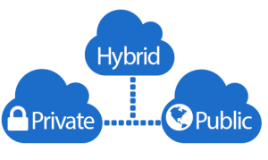

# DevOps Interview Questions & Answers

## Benefits of DevOps
- **Ease of use** : reporting and monitoring of changes helps to keep everyone in process well informed. Each to deploy and test code with automated tools. 
- **Flexibility** : integrates well with different programming languages and tools and able to adapt to changing needs with use of version control system.
- **Robustness** : automated processes and tools used within pipeline. Information and resources shared enabling higher quality of application to be built. 
- **Cost effectiveness** : faster deployment avoids loss of revenue, reduced cost of defects as deployment can be done in iterations which are easier to test and fix.

## Types of Cloud

### Public Cloud
- 100% of the infrastructure or application is migrated to the cloud.
- The organisation relies on the internet or cloud computing services to access the information.
- Small start-ups may use this model as it allows for flexibility, scalability
- Removes the roadblock of costly and time-consuming processes

- **Example:**
Office 365 for emails, Microsoft teams for on demand communication, Microsoft Azure for application deployment are examples where the public cloud will be used.

### Hybrid Cloud
- This is a combination of on-premises and cloud resources
- Confidential data can remain on-premises to comply with regulations such as GDPR, to ensure high security of information
- Public information/ data can be migrated to the cloud

- **Example:**
Banks may adopt hybrid cloud model, confidential information about users such as personal details can be stored privately/ on-premises and information about types of bank accounts, how to apply for a loan can be made publically available on the public cloud. This restricts access to certain types of information and avoids security breaches if data were to leak.

 
### Private Cloud
- On premises deployment is often referred to as private cloud
- Large organisations that have the space, finances, resources to keep data-centres on site or at their location with high security will use the private cloud infrastructure
- Often has traditional infrastructure like servers, cables and requires data centre management.
- Resources are accessed on-site, not using the internet, making them quickly accessible.
- This is where data-privacy is taken very seriously.

- **Example:** 
Google, Amazon, The government will have their own data centres because data privacy is a priority

## Types of Architecture

### Monolith Architecture
- Typically used for smaller application where you have the database, backend, frontend composed altogether as a unifed model.
- It is built in a single unit

### 2-tier Architecture
- This comprises of 2 units: the frontend and backend also known as the presentation layer and the data layer.
- Seperating these 2 components allows the 2 layers to be built seperately with no dependencies affecting the software being developed.

### Micro-services Architecture
- An approach to develop an application as a suite of small services
- It is a lightweight framework with connections to each of the services via apis, environment variables and so on.
- For example you might have payment, shipping, delivery services for a retail application and other services can be developed later too without affecting the main running application.
- Again teams can work independently of another team to develop, allowing quicker time to launch.
